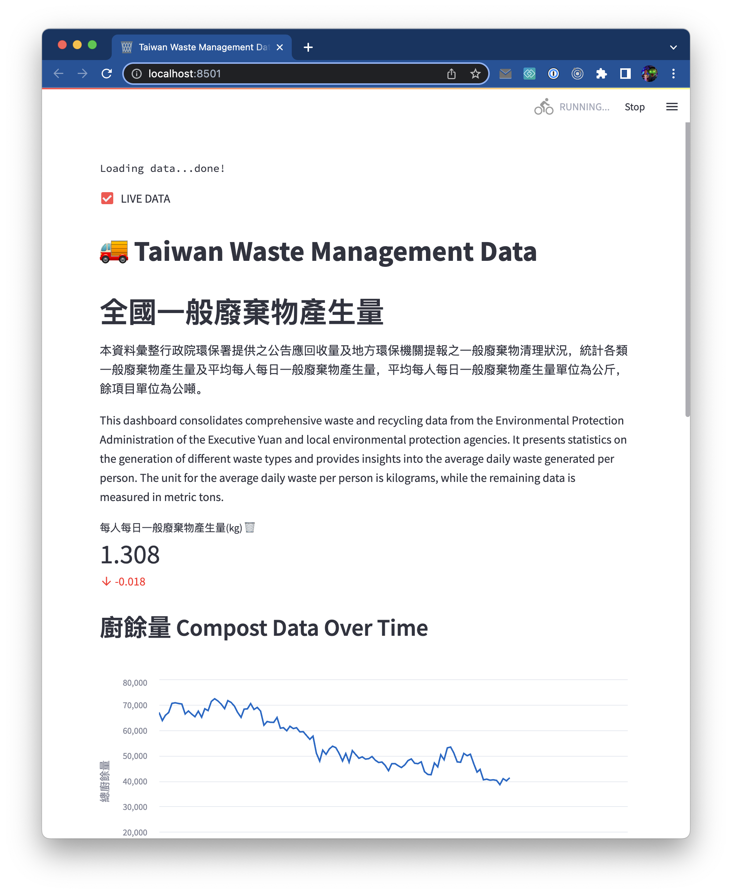

# twgc 
https://garbagecollector.streamlit.app/

**T**ai**W**an **G**arbage **C**ollector: Data visualization for waste management in Taiwan. This dashboard serves as a proof of concept for [Monster Biotech](https://monsterbiotech.com.tw/index.html), so it'll primarily focus on compost data.

## Todo 🚧
- fix live data checkbox placement.
- improve live data streamign capability.
- setup API backend database.
- create forecasting model for compost.
- create more insightful dashboards.